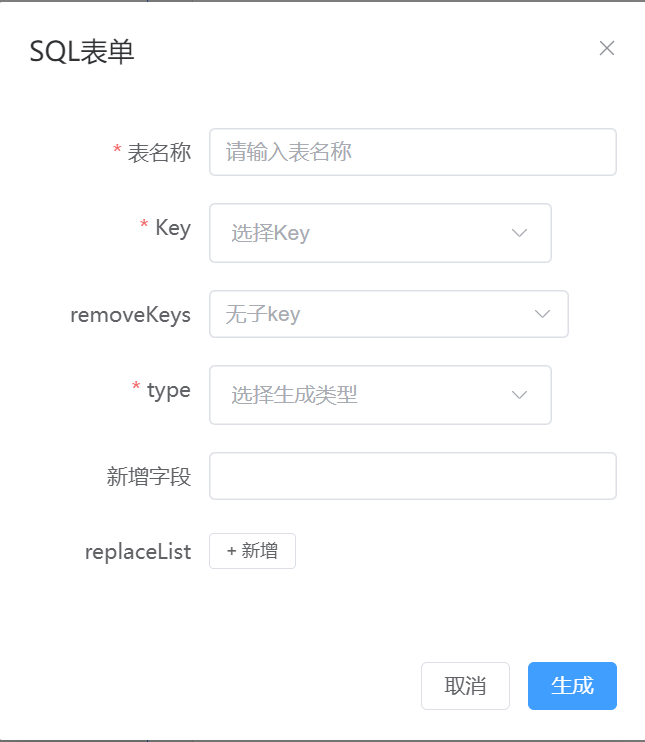
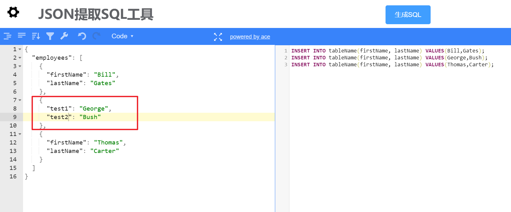
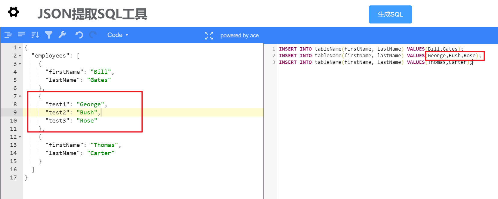
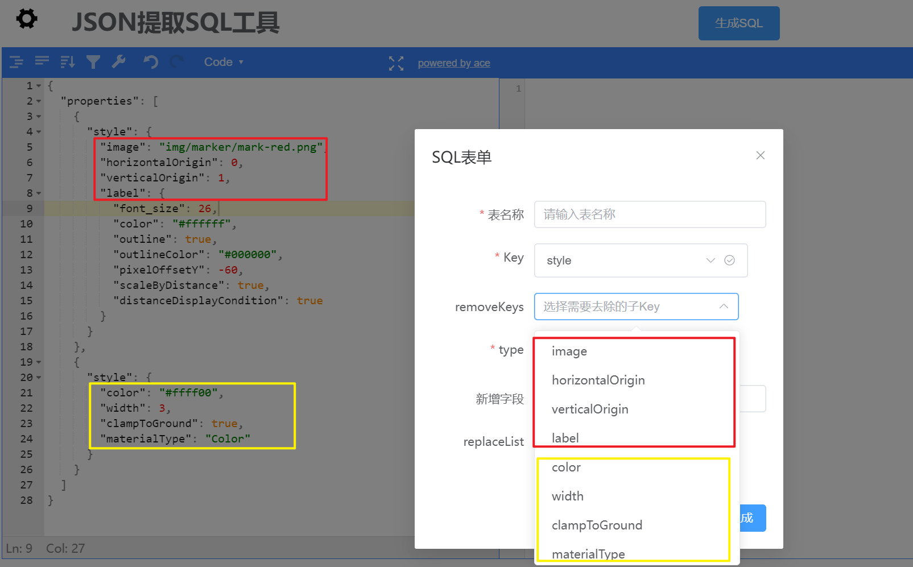
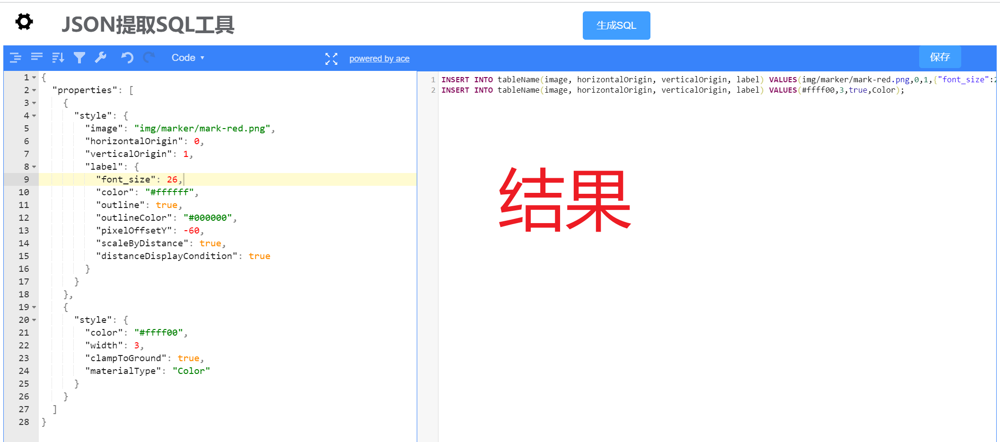
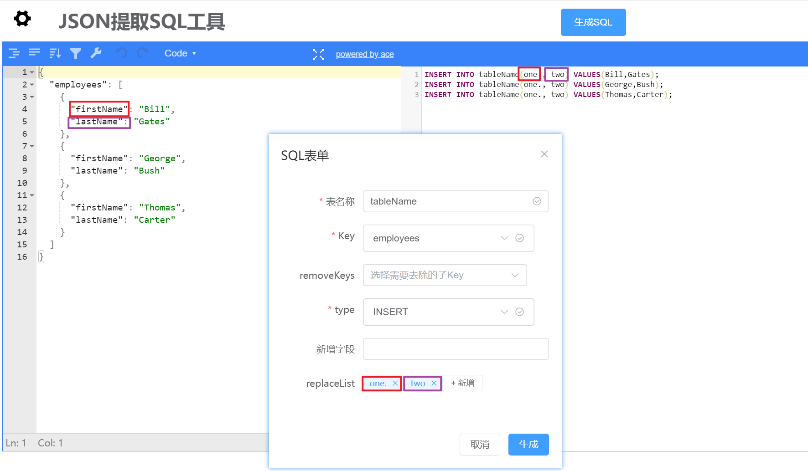
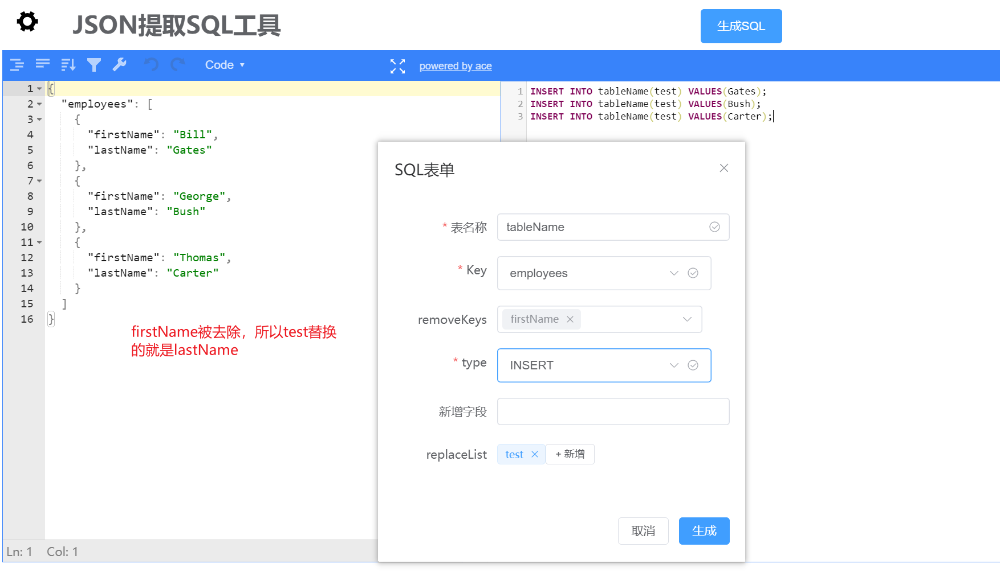

# JSON-extract-SQL

> by [jingLong](https://github.com/Jinglong233)

## 功能

### JSON提取数据生成INSERT语句

- 示例：

```json
{
  "employees": [
    {
      "firstName": "Bill",
      "lastName": "Gates"
    },
    {
      "firstName": "George",
      "lastName": "Bush"
    },
    {
      "firstName": "Thomas",
      "lastName": "Carter"
    }
  ]
}
```

```json
[
  "INSERT INTO tableName(firstName, lastName) VALUES(Bill,Gates);",
  "INSERT INTO tableName(firstName, lastName) VALUES(George,Bush);",
  "INSERT INTO tableName(firstName, lastName) VALUES(Thomas,Carter);"
]
```

### JSON提取数据生成UPDATE语句
- 示例：
```json
{
  "employees": [
    {
      "firstName": "Bill",
      "lastName": "Gates"
    },
    {
      "firstName": "George",
      "lastName": "Bush"
    },
    {
      "firstName": "Thomas",
      "lastName": "Carter"
    }
  ]
}
```
```json
[
  "UPDATE tableName SET firstName = Bill, lastName = Gates WHERE`name`='张三' ;",
  "UPDATE tableName SET firstName = George, lastName = Bush WHERE`name`='张三' ;",
  "UPDATE tableName SET firstName = Thomas, lastName = Carter WHERE`name`='张三' ;"
]
```


> 参数列表：
> 1. 表名称(必填)：生成SQL语句的表名称
> 2. key(必选)：获取该key下的所有k-v
> 3. removeKeys(可选)：剔除对象key下不需要的k-v
> 4. type(必选)：SQL语句的类型（INSERT、UPDATE）
> 5. 新增字段：
>       - UPDATE：可以自定义语句，就是直接将语句拼接到生成的SQL语句后边
>       - INSERT：格式必须是`x=1,y=2`这种形式
> 6. attrList：
>       - 可以替换key的值
>       - 当获取的数据没有key的时候，必须指定(如下：)
```json
{
  "coordinates": [
    106.049833,
    36.381263,
    1518.7
  ]
}
//这种情况必须指定attrList
```
### 其他的一些说明：
1. 尽量保证提取对象每个结构都一致，以下是一些错误的示例。
    - 
    - 出现字段名不统一的情况的时候，都是以第一个对象中的字段名为准。
    - 
    - 同样的这种情况，也是以第一个对象字段数量为准
    - 
    - 当需要提取的多个相同的key，结构不一致的时候，会以第一个为准，但此时数据对应也会出问题
    - 其余待补充。。。
2. 目前只提供了生成INSERT语句和UPDATE语句两种功能，使用的需要注意：
    - 生成INSERT语句，新增字段格式必须是(x=1)，多个新增字段必须使用`,`分隔。否则会报错：
    - 生成UPDATE语句，可以自定义填写一些内容（结果最终是以拼接的方式返回）；不会解析（x=1）这种格式。
3. 可以使用replaceList来替换已有的字段。
    - 不管ReplaceList中有多少个替换字段，都只会替换和原有字段数量相同的前几个
    - 替换的是，去除removeKeys之后的字段数量，如下：
    - 
## 技术栈

### 后端

- Spring Boot 2.7.0
- hutool工具类 5.8.8
- lombok

### 前端

- vue3
- element-plus 2.3.8
- json-editor-vue3 1.0.8（用于输入json字符串）
- codemirror-editor-vue3（用于展示提取的结果）
